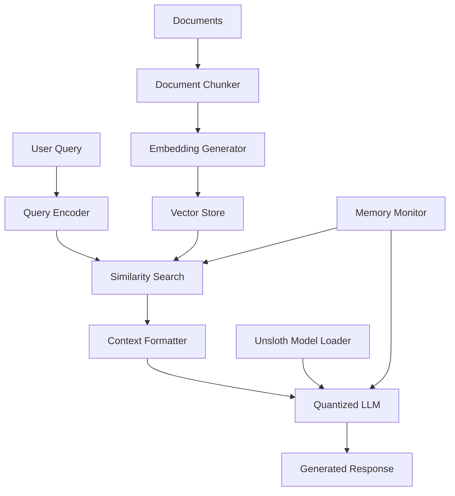

# Design Document

## Overview

The RAG pipeline with Unsloth's dynamic 4-bit quantization is designed as a modular system that combines efficient document retrieval with memory-optimized language model inference. The architecture leverages Unsloth's BitsAndBytes 4-bit quantization to reduce memory footprint while maintaining response quality through selective precision preservation for critical model parameters.

## Architecture

The system follows a three-stage pipeline architecture:

1. **Document Processing & Indexing Stage**: Handles document ingestion, chunking, and embedding generation
2. **Retrieval Stage**: Performs similarity search and context selection
3. **Generation Stage**: Uses the quantized LLM to generate grounded responses



## Components and Interfaces

### 1. Model Management Component

**UnslothModelManager**
- Loads Unsloth dynamic 4-bit quantized models
- Configures BitsAndBytes quantization parameters
- Monitors VRAM usage and implements memory optimization strategies
- Handles model initialization and cleanup

Key methods:
- `load_quantized_model(model_name: str, quantization_config: dict)`
- `get_memory_usage() -> dict`
- `optimize_memory_allocation()`

### 2. Document Processing Component

**DocumentProcessor**
- Handles document ingestion from various formats
- Implements intelligent chunking strategies
- Generates embeddings for document chunks
- Manages document metadata and indexing

Key methods:
- `chunk_documents(documents: List[str], chunk_size: int, overlap: int)`
- `generate_embeddings(chunks: List[str]) -> np.ndarray`
- `create_index(embeddings: np.ndarray, metadata: List[dict])`

### 3. Retrieval Component

**VectorRetriever**
- Performs similarity search against indexed documents
- Implements ranking and filtering mechanisms
- Handles query embedding generation
- Manages retrieval parameters and thresholds

Key methods:
- `encode_query(query: str) -> np.ndarray`
- `retrieve_chunks(query_embedding: np.ndarray, top_k: int) -> List[dict]`
- `filter_by_relevance(chunks: List[dict], threshold: float)`

### 4. RAG Pipeline Component

**RAGPipeline**
- Orchestrates the end-to-end RAG process
- Formats context for the language model
- Handles prompt engineering and response generation
- Implements error handling and fallback mechanisms

Key methods:
- `process_query(query: str) -> str`
- `format_context(retrieved_chunks: List[dict]) -> str`
- `generate_response(query: str, context: str) -> str`

## Data Models

### Document Chunk
```python
@dataclass
class DocumentChunk:
    id: str
    content: str
    metadata: dict
    embedding: Optional[np.ndarray]
    source_document: str
    chunk_index: int
```

### Retrieval Result
```python
@dataclass
class RetrievalResult:
    chunk: DocumentChunk
    relevance_score: float
    rank: int
```

### RAG Response
```python
@dataclass
class RAGResponse:
    query: str
    response: str
    retrieved_chunks: List[RetrievalResult]
    generation_metadata: dict
    memory_usage: dict
```

## Error Handling

### Model Loading Errors
- Implement retry mechanisms for model download failures
- Provide fallback to CPU inference if GPU memory is insufficient
- Clear error messages for unsupported model configurations

### Document Processing Errors
- Skip corrupted documents and log errors
- Handle encoding issues gracefully
- Implement partial processing for large document sets

### Memory Management Errors
- Monitor VRAM usage continuously
- Implement garbage collection strategies
- Provide graceful degradation when memory limits are approached

### Retrieval Errors
- Handle empty retrieval results
- Implement fallback responses when no relevant context is found
- Log retrieval performance metrics

## Testing Strategy

### Unit Tests
- Test individual component functionality
- Mock external dependencies (model loading, embedding generation)
- Validate data transformations and error handling

### Integration Tests
- Test end-to-end pipeline functionality
- Validate memory usage optimization
- Test with various document types and sizes

### Performance Tests
- Benchmark retrieval speed and accuracy
- Measure memory usage under different loads
- Compare quantized vs. full-precision model performance

### Colab Environment Tests
- Test GPU detection and utilization
- Validate installation procedures
- Test fallback mechanisms for resource constraints

## Memory Optimization Strategy

### Dynamic Quantization Configuration
- Use 4-bit quantization for most parameters
- Preserve FP16 precision for attention weights and layer norms
- Implement adaptive precision based on parameter importance

### Memory Monitoring
- Track VRAM usage throughout pipeline execution
- Implement automatic garbage collection triggers
- Provide memory usage reporting and optimization suggestions

### Batch Processing
- Process documents in batches to manage memory usage
- Implement streaming for large document collections
- Use gradient checkpointing during inference when needed

## Colab Integration

### Setup and Installation
- Automated dependency installation with version pinning
- GPU detection and configuration
- Clear progress indicators and status updates

### Interactive Features
- Example queries and expected outputs
- Parameter tuning interface
- Performance monitoring dashboard

### Documentation
- Inline code documentation and explanations
- Troubleshooting guide for common issues
- Performance optimization tips